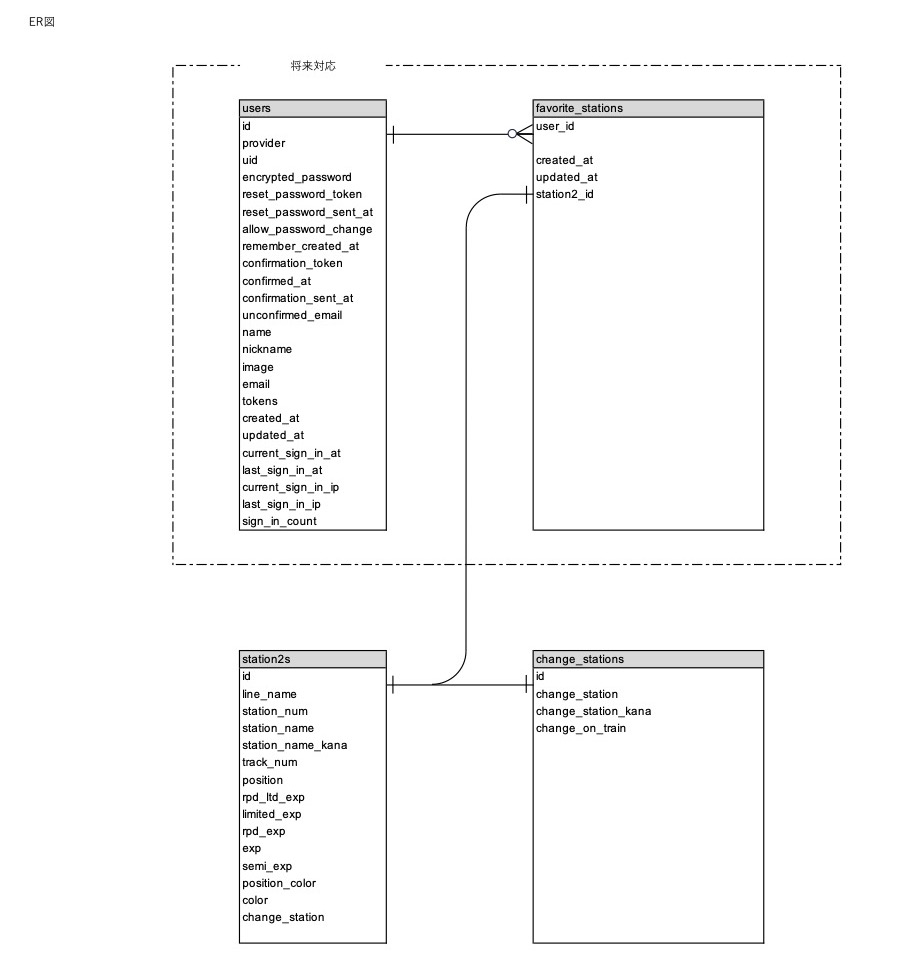

1. プロジェクト名: my_station

2. 概要  
  1.1. 本アプリケーションは"乗車位置チェッカーof名鉄名古屋駅"と同時使用することを想定しています。  
  当該アプリケーションの駅データをpostgreSQLサーバーに格納しています。  
  ```乗車位置チェッカーof名鉄名古屋/github
  　　https://github.com/takeo-t/meitetsu_nagoya
  ```

3. ER図  



5. 作者情報  
   Taiki Takeo  
   X(Twitter) @118satellite  
   E-mail takeo-t@118satellite.com  